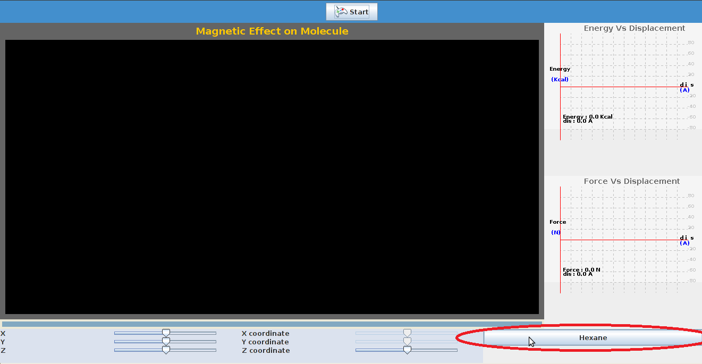
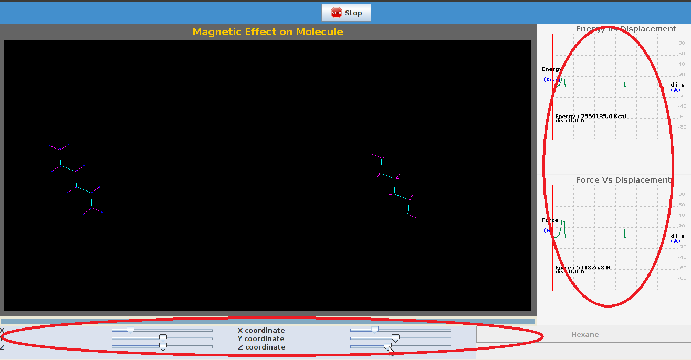

There are certain parameters to be initialized and the procedure detailed here can be followed.
STEP1: Select the type of molecule by clicking on it.

STEP 2:  Click 'Start' to start the experiment.

img src="images/Screenshot-1.png">

STEP 3:  The coordinates of molecule can be varied by varying the sliders provided, a plot of energy, force by varying positions is seen.

