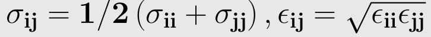

The Lennard-Jones potential is an effective potential that describes the interaction between two uncharged molecules or atoms. The Lennard--Jones potential is mildly attractive as two uncharged molecules or atoms approach one another from a distance, but strongly repulsive when they approach too close. The resulting potential is shown in figure below, at equilibrium the pair of atoms or molecules tend to go toward a separation corresponding to the minimum of the Lennard-Jones potential. 

  

The Lennard Jones potential is common potential used to model VanderWaals interactions.
The strong close in repulsion between atoms or molecules is understandable, resulting from mutual deformation of their structures (meaning, one atom cannot diffuse through another) . When two uncharged particles approach one another, the electron clouds of the competing particles undergo a deformation. During the interaction, each particle does not have a symmetrical electron cloud. As a result each acquires a dipole moment. This is called an induced dipole moment. It lasts for only the short time of near approach, but during this time particles with dipoles are attracted to each other. This attraction is called the London or Van der Waals force. The potential resulting from these attractive and repulsive interactions is called the Lennard--Jones potential,which is given by  

ε = the minimum (well depth) of the potential for the interaction between atom i and j.

σij - the collision diameter,at which inter particle potential is zero.

rij = the distance between the particles.

The parameters ε ,σ is not given for a specific pair and can be found by using Lorentz-berthelot rules.

  

The term r-12 is called repulsive term,observed at short ranges due to overlapping of electron orbitals. The term r-6 describes the attraction at long ranges.
The atoms can be treated as spheres defined by a Van der Waals radius that is a measure of how close another atoms can come before a strong,   very short range, repulsive force kicks in.

  

Van der Waals surface area , also van der Waals surface or van der Waals envelope is the imaginary surface of the union of spherical atom surfaces defined by, the so-called van der Waals radius of each atom in the molecule representation. The van der Waals surface enclosed volume reference is molecular volume.  Both van der Waals surface and molecular volume are abstract representation of molecules, rather than "real" surfaces and volumes of molecules.

